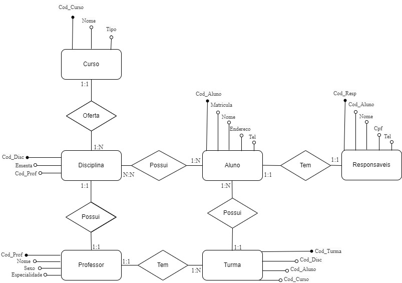
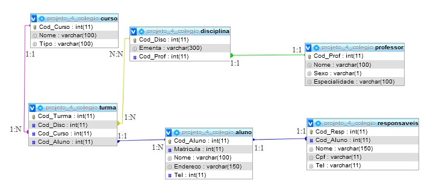

# Projeto-Mod-4.Individual
Projeto referente a Banco de dados.

Missão dada é missão cumprida!

Banco de dados composto por seis entidades, com seus respectivos atributos:
*PK --> Primary key (chave primária)
*FK --> Foreign key (chave estrangeira)

Curso (Cod_Curso (PK), Nome, Tipo)
Aluno (Cod_Aluno, Matricula, Nome, Endereco, Tel)
--Turma (Cod_Turma, Cod_Disc (FK),  Cod_Aluno(FK), Cod_Curso (FK))
--Disciplina (Cod_Disc (PK), Ementa, Cod_Prof (FK))
Professor (Cod_Prof(PK), Nome, Sexo, Especialidade)
--Responsaveis (Cod_Resp (PK), Cod_Aluno(FK), Nome,  CPF, Tel)

